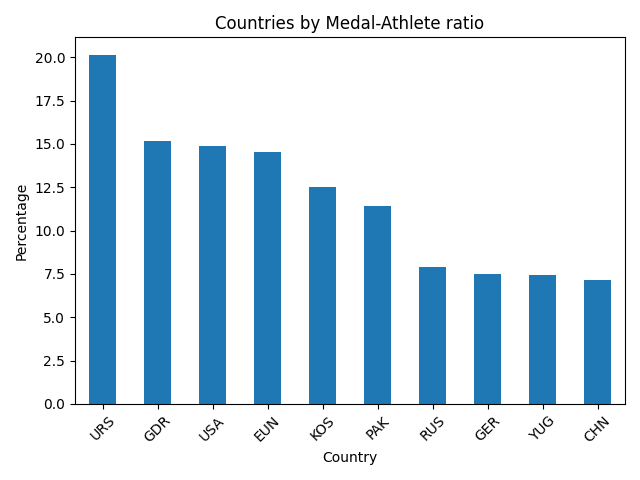
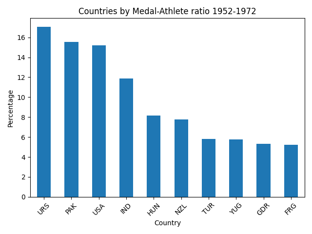
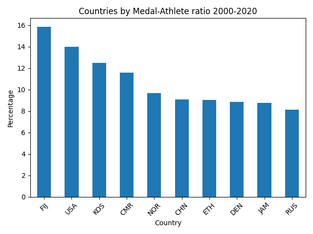

# Project Journal
This is my journal for my personal project starting in Week 6
### Examples of Good Questions
- How does the average age of gold medalists compare to that of participants?
- What are the top 5 sports, by gold medals, for male and female athletes respectively?
- What are the top 5 countries, in gold medals won, in the periods 1950-1970 and 2000-2020?
## My project purpose and audience
### Title
How did the olympic gold medal counts, by country, change between the periods 1952-1972 and 2000-2020?
### Project Statement
In the 1952 Olympics, held in Helsinki, there were 69 participatory countries, while in the 2020 Olympics, held in Tokyo, there were 206 participatory countries. By analysing the leading countries in the period 1952-1972 compared to that of 2000-2020, the aim is to outline how expanded accessibility has influenced the dominating countries. I will not be including East Germany or the USSR, as they have not been in the Olympics during the 2000-2020 period. Furthermore, I will also be measuring the gold medals relative to participation to increase fairness and ensure countries such as the US are not given an advantage due to mere size.
### Intended Audience
Olympics fans and anyone interested in who's done best in which periods.
## Project Functional Requirements
- The program will filter participants for gold medalists and group them into countries, during the periods 1952-1972 and 2000-2020.
- Gold medal count will be divided by participation count to determine a relative medal count.
- I will apply a filter and visualise using two seperate bar graphs.
## Project Non-Functional Requirements
- The project will be presentated simply and as such easy to interpret.
## 3 Test cases

| Test Case              | Input                                | Expected Output                               |
|------------------------|--------------------------------------|-----------------------------------------------|
| 1                      | Medal = 'Gold'                       | All rows will show gold medalists             |
| 2                      | Year >= 1952, Year <= 1972           | All rows will show athletes between 1952-1972 |
| 3                      | Count values per team                | Lists how many teams in file                  |

## Reflection Questions - Monday
1. I chose this particular project question because I thought it would be interesting to see the effect many of the newer countries have had on the older ones.
2. This analysis will benefit anyone curious to know which countries are most capable, on average, and how that has evolved over time.
3. I do not anticipate this to be an especially difficult task, although I would expect some problems to pop up in the coding process.
## Results
Below are the results, with the percentage representing the ratio between total athlete count and medal count, for the periods all time, 1952-1972, and 2000-2020:
#### ALL-TIME

#### 1952-1972

#### 2000-2020

## Code
```
import pandas as pd
import matplotlib.pyplot as plt

# Load dataset
df = pd.read_csv("gold_medalists_cleaned.csv")
df2 = pd.read_csv("athlete_events_cleaned.csv")

# filter for data in period 1952-1972
filtered_df = df[(df['Year'] >= 1952) & (df['Year'] <= 1972)]
print(filtered_df.head())

# filter for data in period 2000-2020
filtered_df2 = df[(df['Year'] >= 2000) & (df['Year'] <= 2020)]
print(filtered_df2.head())

#filter df2 for data in period 1952-1972
filtered2_df = df2[(df2['Year'] >= 1952) & (df2['Year'] <= 1972)]

#filter df2 for data in period 2000-2020
filtered2_df2 = df2[(df2['Year'] >= 2000) & (df2['Year'] <= 2020)]

#-----------------------------
# ALL TIME ATHLETE-MEDAL RATIO
#-----------------------------

#total number of athletes per country
athlete_counts = df2['NOC'].value_counts()

#total number of medals won per country
medal_counts = df['NOC'].value_counts()

# combines two above in dataframe
result = pd.DataFrame({
    "Total Athletes": athlete_counts,
    "Total Medals": medal_counts
}).fillna(0)

# calculate medals per athlete 
result["Medals per Athlete"] = result["Total Medals"] / result["Total Athletes"] 

#convert to percentage
result["Medal-Athlete Percentage Ratio"] = result["Medals per Athlete"] * 100

athlete_medal_ratio = result["Medal-Athlete Percentage Ratio"]

# sort medal winner percentage ratio in descending order
athlete_medal_ratio_sorted = athlete_medal_ratio.sort_values(ascending=False)

country_medal_efficiency_counts = athlete_medal_ratio_sorted.head(10)

#Plot top ten in bar chart
country_medal_efficiency_counts.plot(kind='bar', title='Countries by Medal-Athlete ratio')
plt.xlabel('Country')
plt.ylabel('Percentage')
plt.xticks(rotation=45)
plt.tight_layout()
plt.savefig("country_medal_athlete_ratios_top10.png")
plt.show()

#-----------------------------
#ATHLETE-MEDAL RATIO 1952-1972
#-----------------------------

#total number of athletes per country
athlete_counts = filtered2_df['NOC'].value_counts()

#total number of medals won per country
medal_counts = filtered_df['NOC'].value_counts()

# combines two above in dataframe
result2 = pd.DataFrame({
    "Total Athletes": athlete_counts,
    "Total Medals": medal_counts
}).fillna(0)

# calculate medals per athlete 
result2["Medals per Athlete"] = result2["Total Medals"] / result2["Total Athletes"] 

#convert to percentage
result2["Medal-Athlete Percentage Ratio"] = result2["Medals per Athlete"] * 100

athlete_medal_ratio = result2["Medal-Athlete Percentage Ratio"]

# sort medal winner percentage ratio in descending order
athlete_medal_ratio_sorted = athlete_medal_ratio.sort_values(ascending=False)

country_medal_efficiency_counts = athlete_medal_ratio_sorted.head(10)

#Plot top ten in bar chart
country_medal_efficiency_counts.plot(kind='bar', title='Countries by Medal-Athlete ratio 1952-1972')
plt.xlabel('Country')
plt.ylabel('Percentage')
plt.xticks(rotation=45)
plt.tight_layout()
plt.savefig("country_medal_athlete_ratios_top10_1952_to_1972.png")
plt.show()

#-----------------------------
#ATHLETE-MEDAL RATIO 2000-2020
#-----------------------------

#total number of athletes per country
athlete_counts = filtered2_df2['NOC'].value_counts()

#total number of medals won per country
medal_counts = filtered_df2['NOC'].value_counts()

# combines two above in dataframe
result3 = pd.DataFrame({
    "Total Athletes": athlete_counts,
    "Total Medals": medal_counts
}).fillna(0)

# calculate medals per athlete 
result3["Medals per Athlete"] = result3["Total Medals"] / result3["Total Athletes"] 

#convert to percentage
result3["Medal-Athlete Percentage Ratio"] = result3["Medals per Athlete"] * 100

athlete_medal_ratio = result3["Medal-Athlete Percentage Ratio"]

# sort medal winner percentage ratio in descending order
athlete_medal_ratio_sorted = athlete_medal_ratio.sort_values(ascending=False)

country_medal_efficiency_counts = athlete_medal_ratio_sorted.head(10)

#Plot top ten in bar chart
country_medal_efficiency_counts.plot(kind='bar', title='Countries by Medal-Athlete ratio 2000-2020')
plt.xlabel('Country')
plt.ylabel('Percentage')
plt.xticks(rotation=45)
plt.tight_layout()
plt.savefig("country_medal_athlete_ratios_top10_2000_to_2020.png")
plt.show()
```
